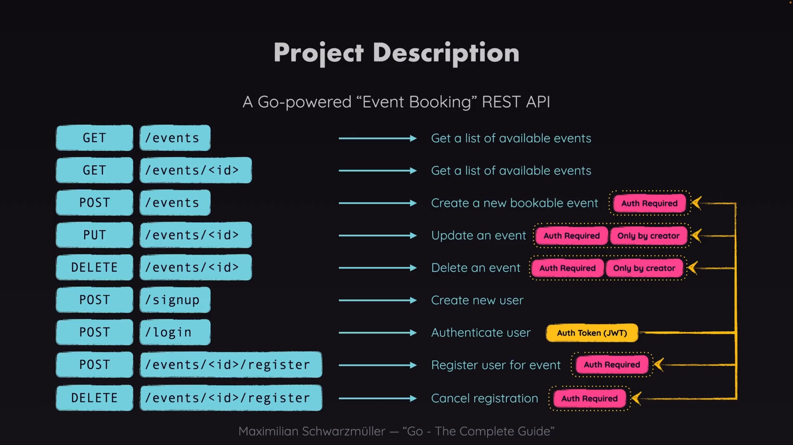

# EBA - Event Booking API

EBA, Event Booking API, is a backend service built using Go's Gin web framework. This API allows users to create, view, update, and delete events (CRUD operations), as well as register for and cancel registrations for specific events. I followed the course "Go - The Complete Guide" by Maximilian Schwarzmüller to develop this project.

## Key Features

- **Event Management**: Create, update, delete, and fetch events.
- **User Registration**: Register and cancel registration for events.
- **JWT Authentication**: Secure routes for event creation and registration using JWT.
- **Password Security**: Passwords are hashed using bcrypt.

## Tech Stack

- **Backend**: [Golang](https://golang.org/) with [Gin Framework](https://github.com/gin-gonic/gin)
- **Authentication**: [JWT](https://jwt.io/) and [jwt-go](https://pkg.go.dev/github.com/golang-jwt/jwt)
- **Password Hashing**: [bcrypt](https://pkg.go.dev/golang.org/x/crypto/bcrypt)


## Demonstration



## Description of API Endpoints

### Public Routes
- **GET** `/events`: Fetch a list of all events.
- **GET** `/events/:id`: Fetch details of a specific event by ID.
- **POST** `/signup`: Sign up a new user.
- **POST** `/login`: Log in a user to receive an authentication token.

### Protected Routes (Require Authentication)
- **POST** `/events`: Create a new event.
- **PUT** `/events/:id`: Update an existing event by ID.
- **DELETE** `/events/:id`: Delete an event by ID.
- **POST** `/events/:id/register`: Register for a specific event by ID.
- **DELETE** `/events/:id/register`: Cancel registration for a specific event by ID.


## Installation

1. Clone the repository:
   ```bash
   git clone https://github.com/Soyaib10/eba-event-booking-api
   cd eba-event-booking-api
   ```

2. Install dependencies:
   ```bash
   go mod tidy
   ```

3. Run the server:
   ```bash
   go run *.go
   ```

## Authentication

The API uses JWT for authentication. After logging in, you will receive a token that must be included in the headers of the requests to protected routes.

Example of using a token in the Authorization header:
```
Authorization: <your-token>
```

## Dependencies

- **Gin**: Web framework used to build the API.
- **JWT-Go**: Used for handling JSON Web Tokens (JWT) for authentication.
- **Bcrypt**: Used to hash passwords securely.

## 🌟 You've Made It This Far!

Wow, that’s amazing! Thank you so much for your interest and support.

If you’ve enjoyed working with this project, a ⭐️ would be greatly appreciated. Feel free to share any advice or thoughts you have—I’d love to hear from you!

---

**🔗 [Give a Star ⭐️](https://github.com/Soyaib10/eba-event-booking-api)**

**💬 [Share Your Thoughts](mailto:soyaibzihad10@gmail.com)**

Once again, thank you for your encouragement! 😊